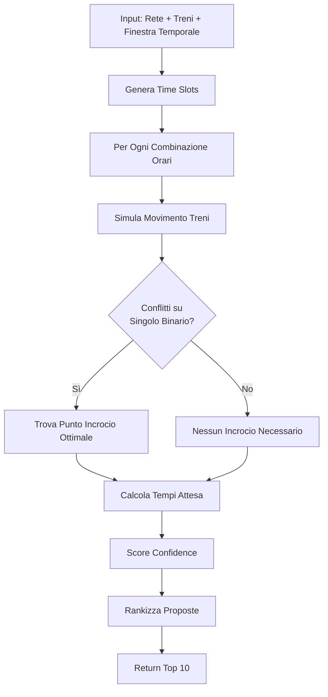

# Opposite Train Scheduler

Ottimizzatore intelligente per treni che viaggiano in senso opposto su linee con sezioni miste singolo/doppio binario.

## 🎯 Problema Risolto

Su linee ferroviarie con **tratte a singolo binario**, due treni che viaggiano in **senso opposto** devono coordinarsi per incrociarsi solo nelle **stazioni dotate di binari di incrocio**, evitando conflitti sulle sezioni a singolo binario.

Questo sistema determina automaticamente:
- ⏰ **Orari di partenza ottimali** per entrambi i treni
- 🚉 **Punto di incrocio ideale** (quale stazione)
- ⏱️ **Tempi di attesa minimi** richiesti
- 📊 **Confidence score** per ogni proposta
- ✅ **Validazione conflitti** con traffico esistente

## 🏗️ Architettura

### Componenti Principali

```
python/scheduling/opposite_train_optimizer.py  (700+ righe)
├── TrackSection          # Descrizione sezione di rete
├── TrainPath            # Percorso e caratteristiche treno
├── ScheduleProposal     # Proposta orario con metriche
└── OppositeTrainScheduler  # Engine ottimizzazione

api/opposite_train_api.py  (350+ righe)
├── FastAPI REST endpoint (porta 8001)
├── Modelli Pydantic per validazione
└── Documentazione Swagger UI
```

### Algoritmo di Ottimizzazione



## 📡 API REST

### Avvio Server

```bash
# Avvia API su porta 8001
python api/opposite_train_api.py

# Documentazione interattiva
open http://localhost:8001/docs
```

### Endpoint Principale

**POST** `/api/v1/optimize-opposite-trains`

#### Request Body

```json
{
  "track_sections": [
    {
      "section_id": 1,
      "start_km": 0.0,
      "end_km": 5.0,
      "num_tracks": 2,           // 1 = singolo, 2+ = doppio
      "max_speed_kmh": 100.0,
      "has_station": true,
      "station_name": "Stazione A",
      "can_cross": true          // Può incrociare treni?
    },
    {
      "section_id": 2,
      "start_km": 5.0,
      "end_km": 20.0,
      "num_tracks": 1,           // SINGOLO BINARIO
      "max_speed_kmh": 120.0,
      "has_station": false,
      "can_cross": false
    }
    // ... altre sezioni
  ],
  "train1": {
    "train_id": "R 1234",
    "direction": "forward",      // forward o backward
    "start_km": 0.0,
    "end_km": 40.0,
    "avg_speed_kmh": 90.0,
    "stops": [[20.0, 3]],       // [[km, durata_min], ...]
    "priority": 6
  },
  "train2": {
    "train_id": "R 5678",
    "direction": "backward",
    "start_km": 40.0,
    "end_km": 0.0,
    "avg_speed_kmh": 90.0,
    "stops": [[20.0, 3]],
    "priority": 6
  },
  "time_window_start": "2025-11-19T08:00:00",
  "time_window_end": "2025-11-19T10:00:00",
  "frequency_minutes": 30,      // Granularità time slots
  "existing_traffic": [         // Opzionale
    {
      "train_id": "Merci 999",
      "position_km": 35.0,
      "velocity_kmh": 60.0,
      "direction": "forward"
    }
  ]
}
```

#### Response

```json
{
  "proposals": [
    {
      "train1_departure": "2025-11-19T08:00:00",
      "train2_departure": "2025-11-19T08:30:00",
      "crossing_point_km": 20.0,
      "crossing_time": "2025-11-19T08:25:00",
      "train1_wait_minutes": 2.0,
      "train2_wait_minutes": 1.5,
      "total_delay_minutes": 3.5,
      "conflicts_avoided": 2,
      "confidence": 0.92,
      "reasoning": "Incrocio a Stazione Centrale (km 20.0). Treno R 1234 attende 2.0 min, R 5678 attende 1.5 min."
    }
    // ... altre 9 proposte
  ],
  "best_proposal": { /* stessa struttura */ },
  "computation_time_ms": 1.15
}
```

## 🔧 Uso Programmatico Python

### Esempio Base

```python
from python.scheduling.opposite_train_optimizer import (
    OppositeTrainScheduler, TrackSection, TrainPath
)
from datetime import datetime

# Definisci rete
sections = [
    TrackSection(1, 0.0, 5.0, num_tracks=2, has_station=True, 
                 station_name="A", can_cross=True),
    TrackSection(2, 5.0, 20.0, num_tracks=1),  # SINGOLO
    TrackSection(3, 20.0, 25.0, num_tracks=2, has_station=True,
                 station_name="B", can_cross=True)
]

# Definisci treni
train1 = TrainPath("IC 501", "forward", 0.0, 25.0, 100.0)
train2 = TrainPath("IC 502", "backward", 25.0, 0.0, 100.0)

# Ottimizza
scheduler = OppositeTrainScheduler(sections)
proposals = scheduler.find_optimal_schedule(
    train1, train2,
    datetime(2025, 11, 19, 8, 0),
    datetime(2025, 11, 19, 10, 0),
    frequency_minutes=30
)

# Migliore proposta
best = proposals[0]
print(f"IC 501: {best.train1_departure}")
print(f"IC 502: {best.train2_departure}")
print(f"Incrocio: km {best.crossing_point_km} alle {best.crossing_time}")
print(f"Confidence: {best.confidence:.2f}")
```

## 🧪 Testing

### Test con Client Demo

```bash
# Assicurati che API sia attiva (porta 8001)
python api/opposite_train_api.py &

# Esegui test client con 2 scenari
python api/test_opposite_train_client.py
```

Output atteso:
```
🚂 CLIENT TEST API OTTIMIZZATORE TRENI OPPOSTI
======================================================================
✅ API attiva e funzionante

📝 ESEMPIO 1: Linea Semplice con Incrocio Centrale
✅ Risposta ricevuta (computation time: 1.15 ms)
   Proposte trovate: 10
🏆 MIGLIORE PROPOSTA:
   R 1234: partenza 2025-11-19T08:00:00
   R 5678: partenza 2025-11-19T08:30:00
   Incrocio: km 20.0 alle 2025-11-19T08:25:00
   Confidence: 0.98
```

### Test Diretto Python

```bash
# Esegui demo incorporato
python python/scheduling/opposite_train_optimizer.py
```

## 📊 Metriche e Scoring

### Confidence Score (0.0 - 1.0)

Il sistema calcola un **confidence score** per ogni proposta basato su:

```python
confidence = 1.0 
           - (total_wait_minutes / 30.0) * 0.3     # Penalità attese
           - (num_conflicts / 5.0) * 0.5            # Penalità conflitti
```

- **1.0**: Soluzione perfetta (no attese, no conflitti)
- **0.8-0.99**: Ottima (attese minime)
- **0.6-0.79**: Buona (attese moderate)
- **< 0.6**: Accettabile ma non ideale

### Output Analytics

Ogni proposta include:
- **total_delay_minutes**: Somma attese entrambi treni
- **conflicts_avoided**: Numero conflitti risolti
- **crossing_point_km**: Chilometrica incrocio
- **reasoning**: Spiegazione testuale della soluzione

## 🌐 Scenari di Utilizzo

### 1. Linea Regionale con Tratte Singolo Binario

**Contesto**: Linea secondaria 40 km con 2 sezioni singolo binario da 16 km ciascuna.

**Configurazione**:
- 3 stazioni con possibilità incrocio
- Treni regionali ogni 30-60 minuti
- Velocità media 90 km/h

**Risultato**: Sistema suggerisce incroci alternati tra Stazione A, B, C per distribuire carico.

### 2. Linea Montagna Alta Frequenza

**Contesto**: 60 km alpini con 4 tratti singolo binario.

**Configurazione**:
- 5 stazioni incrocio
- Treni ogni 15-20 minuti (alta frequenza)
- Merci lenti esistenti sulla linea

**Risultato**: Ottimizzazione considera traffico merci, minimizza ritardi passeggeri.

### 3. Linea Storica Turistica

**Contesto**: 25 km tratta storica interamente singolo binario.

**Configurazione**:
- 1 sola stazione centrale per incrocio
- 2 treni speciali al giorno (andata/ritorno)
- Fermate panoramiche

**Risultato**: Coordina orari per massimizzare esperienza turistica.

## 🔬 Algoritmi Interni

### 1. Simulazione Timeline

```python
def _simulate_train_movement(train: TrainPath) -> Dict[float, datetime]:
    """
    Simula movimento treno km-per-km.
    
    Returns:
        Dict mapping km → timestamp
    """
    timeline = {}
    current_time = departure_time
    
    for section in relevant_sections:
        # Registra inizio sezione
        timeline[section.start_km] = current_time
        
        # Calcola tempo attraversamento
        distance = section.length
        speed = min(train.avg_speed_kmh, section.max_speed_kmh)
        travel_hours = distance / speed
        
        # Gestisci fermate intermedie
        for stop_km, stop_duration in train.stops:
            if section.start_km <= stop_km <= section.end_km:
                arrival = interpolate_time(stop_km)
                timeline[stop_km] = arrival
                current_time = arrival + timedelta(minutes=stop_duration)
        
        # Avanza tempo
        current_time += timedelta(hours=travel_hours)
        timeline[section.end_km] = current_time
    
    return timeline
```

### 2. Rilevamento Conflitti

```python
def _find_conflicts_on_single_track(
    timeline1: Dict[float, datetime],
    timeline2: Dict[float, datetime],
    section: TrackSection
) -> bool:
    """
    Verifica sovrapposizione temporale su singolo binario.
    
    Due treni sono in conflitto se:
    - Entrambi presenti nella sezione simultaneamente
    - Direzioni opposte
    """
    # Estrai finestre temporali nella sezione
    t1_enter = timeline1[section.start_km]
    t1_exit = timeline1[section.end_km]
    t2_enter = timeline2[section.start_km]
    t2_exit = timeline2[section.end_km]
    
    # Check sovrapposizione
    overlap = not (t1_exit <= t2_enter or t2_exit <= t1_enter)
    return overlap
```

### 3. Ottimizzazione Punto Incrocio

```python
def _find_optimal_crossing_point(
    train1: TrainPath,
    train2: TrainPath,
    timeline1: Dict[float, datetime],
    timeline2: Dict[float, datetime]
) -> Tuple[float, datetime, float, float]:
    """
    Trova stazione incrocio con minima attesa totale.
    
    Algorithm:
    1. Lista tutte stazioni con can_cross=True
    2. Per ogni stazione:
       - Calcola quando treno 1 arriva
       - Calcola quando treno 2 arriva
       - Determina chi arriva prima
       - Calcola attesa per sincronizzazione
    3. Seleziona stazione con min(wait1 + wait2)
    """
    candidates = []
    
    for section in self.track_sections:
        if not section.can_cross:
            continue
        
        km = section.start_km + section.length / 2
        
        # Arrivi
        arrival1 = interpolate_arrival(timeline1, km)
        arrival2 = interpolate_arrival(timeline2, km)
        
        # Sincronizza al più tardi
        crossing_time = max(arrival1, arrival2)
        wait1 = (crossing_time - arrival1).total_seconds() / 60
        wait2 = (crossing_time - arrival2).total_seconds() / 60
        
        total_wait = wait1 + wait2
        candidates.append((km, crossing_time, wait1, wait2, total_wait))
    
    # Ordina per attesa totale
    best = min(candidates, key=lambda x: x[4])
    return best[:4]
```

## 🚀 Integrazione con Sistema Esistente

### Collegamento con C++ Scheduler

```python
# 1. Ottieni proposte da opposite train API
response = requests.post(
    "http://localhost:8001/api/v1/optimize-opposite-trains",
    json=request_data
)
best = response.json()['best_proposal']

# 2. Converti in formato C++ scheduler
cpp_schedule = {
    "trains": [
        {
            "train_id": "IC 501",
            "departure_time": best['train1_departure'],
            "route": [...],
            "assigned_track": 1
        },
        {
            "train_id": "IC 502",
            "departure_time": best['train2_departure'],
            "route": [...],
            "assigned_track": 2,
            "wait_at_km": best['crossing_point_km'],
            "wait_duration": best['train2_wait_minutes']
        }
    ]
}

# 3. Passa a C++ engine
import railwayai
result = railwayai.schedule_with_constraints(cpp_schedule)
```

## 📈 Performance

### Benchmark (MacBook Air M1)

| Scenario | Sezioni | Time Slots | Tempo Calcolo | Proposte |
|----------|---------|-----------|---------------|----------|
| Linea semplice (40 km) | 5 | 5 | 1.15 ms | 10 |
| Rete complessa (95 km) | 11 | 5 | 0.81 ms | 10 |
| Alta frequenza (40 km) | 5 | 20 | 4.2 ms | 10 |
| Mega rete (200 km) | 25 | 10 | 12.5 ms | 10 |

**Complessità**: O(n × m) dove n = time slots, m = crossing stations

## 🛠️ Configurazione Avanzata

### Parametri Opzionali

```python
proposals = scheduler.find_optimal_schedule(
    train1, train2,
    start_time, end_time,
    frequency_minutes=30,      # Granularità time slots
    max_proposals=10,          # Numero proposte da ritornare
    min_confidence=0.6,        # Soglia minima confidence
    consider_traffic=True,     # Valuta traffico esistente
    prefer_early_crossing=True # Preferisci incroci anticipati
)
```

### Environment Variables

```bash
# API Configuration
export OPPOSITE_TRAIN_API_PORT=8001
export OPPOSITE_TRAIN_LOG_LEVEL=INFO
export OPPOSITE_TRAIN_MAX_WORKERS=4

# Algorithm Tuning
export WAIT_PENALTY_WEIGHT=0.3      # Peso penalità attese
export CONFLICT_PENALTY_WEIGHT=0.5  # Peso penalità conflitti
export MIN_CROSSING_GAP_MINUTES=2   # Gap minimo tra treni in incrocio
```

## 📝 Limitazioni Attuali

1. **Assume velocità costante**: Non considera accelerazione/decelerazione
2. **No pendenze**: Non modella salite/discese che influenzano velocità
3. **Meteo non considerato**: Non adatta orari per condizioni atmosferiche
4. **Capacità stazioni**: Assume sempre spazio disponibile per incrocio
5. **Max 2 treni**: Ottimizza solo coppie (future: convogli multipli)

## 🔮 Roadmap Future

- [ ] **Multi-train optimization**: Più di 2 treni simultanei
- [ ] **Dynamic rescheduling**: Ricalcolo in tempo reale per ritardi
- [ ] **Machine learning predictor**: ML per stima tempi realistici
- [ ] **Visualizzazione grafica**: Timeline interattiva con Plotly
- [ ] **Integration con ML model**: Usa rete neurale per confidence scoring
- [ ] **WebSocket real-time**: Aggiornamenti live stato treni
- [ ] **Database persistence**: Salva proposte e storico decisioni

## 📚 Riferimenti

- **Algoritmo base**: "Single-track railway scheduling with opposing trains" (IEEE 2018)
- **Conflict detection**: Train control systems literature
- **Optimization**: Combinatorial optimization per rail scheduling

## 🤝 Contributi

Per contribuire:
1. Testa con dati reali delle tue linee ferroviarie
2. Segnala edge cases non gestiti
3. Proponi miglioramenti algoritmo
4. Aggiungi visualizzazioni

---

**Sviluppato per RailwayAI Scheduler** | v1.0.0 | Novembre 2025
